# Entorno de desarrollo y producción con aplicaciones web python

**Tarea 1: Entorno de desarrollo**
Formas parte del equipo de desarrollo de la aplicación “Gestión IESGN”, aplicación web desarrollada con python, con el framework django. Vamos a configurar tu equipo como entorno de desarrollo para trabajar con la aplicación, para ello:
- Realiza un fork del repositorio de GitHub: https://github.com/jd-iesgn/iaw_gestionGN.

[Repositorio](https://github.com/PalomaR88/iaw_gestionGN)

- Clona el repositorio en tu equipo.
~~~
paloma@coatlicue:~/DISCO2/CICLO II/IMPLANTACIÓN DE APLICACIONES WEB$ git clone git@github.com:PalomaR88/iaw_gestionGN.git
~~~

- Crea un entorno virtual python3 e instala las dependencias necesarias para que funcione el proyecto (fichero requierements.txt).
Creación del entorno:
~~~
paloma@coatlicue:~/DISCO2$ mkdir virtualenv
paloma@coatlicue:~/DISCO2$ cd virtualenv/
paloma@coatlicue:~/DISCO2/virtualenv$ python3 -m venv django
paloma@coatlicue:~/DISCO2/virtualenv$ source django/bin/activate
~~~

Instalación de los paquetes:
~~~
(django) paloma@coatlicue:~/DISCO2/CICLO II/IMPLANTACIÓN DE APLICACIONES W
EB/iaw_gestionGN$ pip install -r requirements.txt 
~~~

En la instalación de los paquetes que aparecen en requirements.txt surgen errores que hay que solucionar:
~~~
(django) paloma@coatlicue:~/DISCO2/CICLO II/IMPLANTACIÓN DE APLICACIONES W
EB/iaw_gestionGN$ sudo apt install python3-dev
(django) paloma@coatlicue:~/DISCO2/CICLO II/IMPLANTACIÓN DE APLICACIONES W
EB/iaw_gestionGN$ pip3 install wheel
(django) paloma@coatlicue:~/DISCO2/CICLO II/IMPLANTACIÓN DE APLICACIONES W
EB/iaw_gestionGN$ sudo apt install libjpeg-dev
~~~

Este debe de ser el rescultado:
~~~
(django) paloma@coatlicue:~/DISCO2/CICLO II/IMPLANTACIÓN DE APLICACIONES W
EB/iaw_gestionGN$ pip freeze
Django==1.10.2
html5lib==1.0b8
olefile==0.46
Pillow==4.0.0
pkg-resources==0.0.0
PyPDF2==1.26.0
pytz==2019.3
reportlab==3.3.0
six==1.10.0
sqlparse==0.3.0
webencodings==0.5
xhtml2pdf==0.0.6
~~~

- Comprueba que vamos a trabajar con una base de datos sqlite (gestion\settings.py). ¿Cómo se llama la base de datos que vamos a crear?
~~~
DATABASES = {
    'default': {
        'ENGINE': 'django.db.backends.sqlite3',
        'NAME': os.path.join(BASE_DIR, 'db.sqlite3'),
    }
}
~~~

- Crea la base de datos: python3 manage.py migrate. A partir del modelo de datos se crean las tablas de la base de datos.
~~~
(django) paloma@coatlicue:~/DISCO2/CICLO II/IMPLANTACIÓN DE APLICACIONES W
EB/iaw_gestionGN$ python3 manage.py migrate
Operations to perform:
  Apply all migrations: admin, auth, centro, contenttypes, convivencia, sessions
Running migrations:
  Applying contenttypes.0001_initial... OK
  Applying auth.0001_initial... OK
  Applying admin.0001_initial... OK
  Applying admin.0002_logentry_remove_auto_add... OK
  Applying admin.0003_logentry_add_action_flag_choices... OK
  Applying contenttypes.0002_remove_content_type_name... OK
  Applying auth.0002_alter_permission_name_max_length... OK
  Applying auth.0003_alter_user_email_max_length... OK
  Applying auth.0004_alter_user_username_opts... OK
  Applying auth.0005_alter_user_last_login_null... OK
  Applying auth.0006_require_contenttypes_0002... OK
  Applying auth.0007_alter_validators_add_error_messages... OK
  Applying auth.0008_alter_user_username_max_length... OK
  Applying auth.0009_alter_user_last_name_max_length... OK
  Applying auth.0010_alter_group_name_max_length... OK
  Applying auth.0011_update_proxy_permissions... OK
  Applying centro.0001_initial... OK
  Applying centro.0002_cursos_equipoeducativo... OK
  Applying centro.0003_auto_20161102_1656... OK
  Applying centro.0004_auto_20161102_1721... OK
  Applying centro.0005_auto_20161105_1217... OK
  Applying centro.0006_auto_20161106_1741... OK
  Applying convivencia.0001_initial... OK
  Applying sessions.0001_initial... OK
~~~

- Añade los datos de prueba a la base de datos. Para más información: https://coderwall.com/p/mvsoyg/django-dumpdata-and-loaddata. Utiliza el fichero datos.json.
~~~
(django) paloma@coatlicue:~/DISCO2/CICLO II/IMPLANTACIÓN DE APLICACIONES W
EB/iaw_gestionGN$ ./manage.py loaddata datos.json 
Installed 89 object(s) from 1 fixture(s)
~~~

- Entra en la zona de administración para comprobar que los datos se han añadido correctamente. Usuario: admin contraseña: asdasd1234).

Se ejecuta el servidor web:
~~~
(django) paloma@coatlicue:~/DISCO2/CICLO II/IMPLANTACIÓN DE APLICACIONES W
EB/iaw_gestionGN$ python manage.py runserver
Watching for file changes with StatReloader
Performing system checks...
System check identified no issues (0 silenced).
November 21, 2019 - 19:57:57
Django version 2.2.7, using settings 'gestion.settings'
Starting development server at http://127.0.0.1:8000/
Quit the server with CONTROL-C.
~~~

Y en la página se accede con el usuario admin.
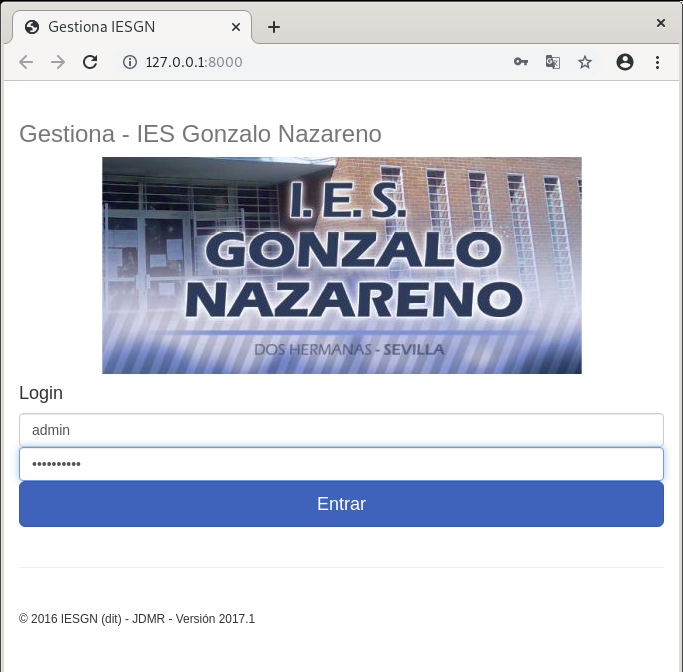
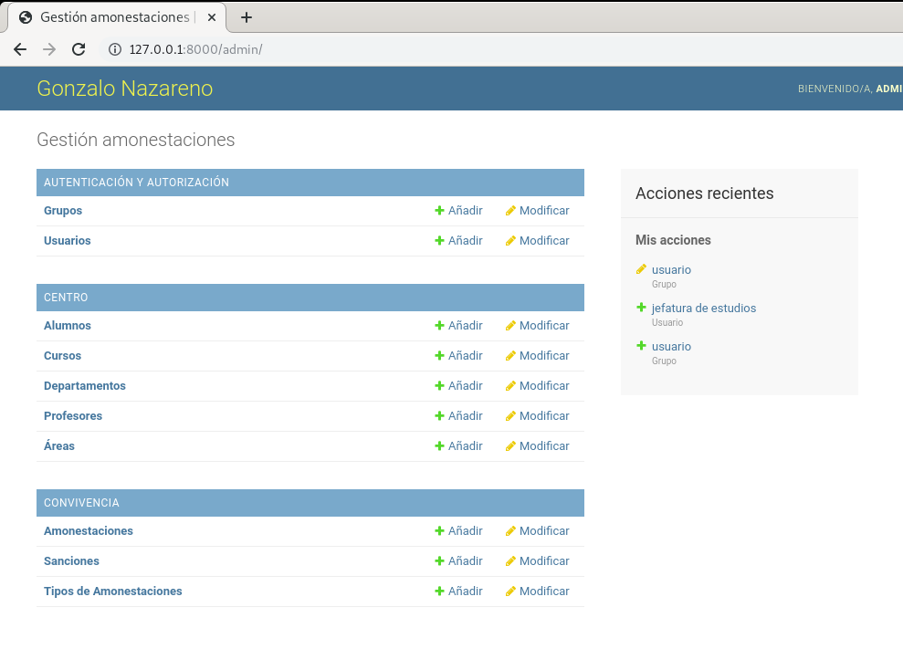

- Ejecuta el servidor web de desarrollo y comprueba en el navegador que la aplicación está funcionando. Accede con el usuario usuario (contraseña: asdasd1234).
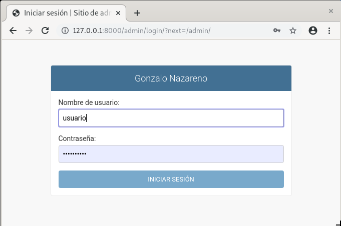

En este momento, muestra al profesor la aplicación funcionando. Entrega una documentación resumida donde expliques los pasos fundamentales para realizar esta tarea.

**Tarea 2: Desarrollando nuestra aplicación**

Vamos a realizar un cambio en la aplicación y comprobar que los cambios se realizan correctamente.
- Modifica la página inicial de la aplicación para que aparezca tu nombre.

En templates/base.html se modifica una línea para que aparezca el nombre:
~~~
      

        <h3 class="text-muted">Gestiona - IES Gonzalo Nazareno</h3>
        <a>Paloma R.<a>
      

~~~

- Sube los cambios al repositorio
~~~
paloma@coatlicue:~/DISCO2/CICLO II/IMPLANTACIÓN DE APLICACIONES WEB/iaw_ge
stionGN$ git commit -am 'añadir nombre'
paloma@coatlicue:~/DISCO2/CICLO II/IMPLANTACIÓN DE APLICACIONES WEB/iaw_ge
stionGN$ git push
~~~

Muestra una captura de pantalla donde sea la modificación realizada.

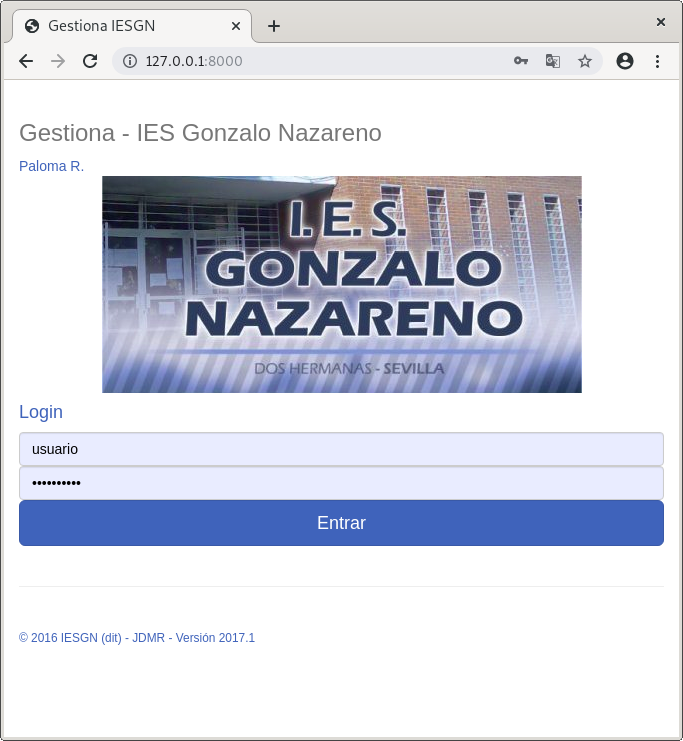

**Tarea 3: Entorno de producción**

Vamos a realizar el despliegue de nuestra aplicación en un entorno de producción, para ello vamos a utilizar una instancia del cloud, para ello:

- Instala en el servidor los servicios necesarios (apache2, mysql, …). Instala el módulo de apache2 para ejecutar código python.
~~~
debian@python:~$ sudo apt install apache2
debian@python:~$ sudo apt install libapache2-mod-wsgi-py3
debian@python:~$ sudo apt install mysql-common 
debian@python:~$ sudo apt install git
~~~

- Clona tu repositorio en el DocumentRoot de tu virtualhost.
Se va a utilizar el .conf por defecto, cuya configuración del DocumentRoot es la siguiente:
~~~
debian@python:~$ cat /etc/apache2/sites-available/000-default.conf 
<VirtualHost *:80>
...
	ServerAdmin webmaster@localhost
	DocumentRoot /var/www/html
...
~~~

Habrá que clonar el repositorio en /var/www/html:
~~~
debian@python:/var/www/html$ sudo git clone https://github.com/PalomaR88/iaw_gestionGN.git
~~~

- Crea un entorno virtual e instala las dependencias de tu aplicación.

Creación del entorno:
~~~
debian@python:~$ mkdir virtualend
debian@python:~$ cd virtualend/
debian@python:~/virtualend$ sudo apt install python3-venv
debian@python:~/virtualend$ python3 -m venv django
debian@python:~/virtualend$ source django/bin/activate
(django) debian@python:~/virtualend$ 
~~~

Instalación de paquetes:
~~~
(django) debian@python:/var/www/html/iaw_gestionGN$ pip install -r requirements.txt 
~~~

> De nuevo, hace falta algunas dependencias para que se descarguen todos los paquetes que aparecen en el requeriment.txt
~~~
(django) debian@python:/var/www/html/iaw_gestionGN$ sudo apt-get install python3 python-dev python3-dev build-essential libssl-dev libffi-dev libxml2-dev libxslt1-dev zlib1g-dev python-pip libjpeg-dev
~~~
~~~
(django) debian@python:/var/www/html/iaw_gestionGN$ pip freeze
Django==2.2.7
html5lib==1.0b8
olefile==0.46
Pillow==4.0.0
pkg-resources==0.0.0
PyPDF2==1.26.0
pytz==2019.3
reportlab==3.3.0
six==1.10.0
sqlparse==0.3.0
webencodings==0.5
xhtml2pdf==0.0.6
~~~

- Instala el módulo que permite que python trabaje con mysql:
~~~
      $ apt install python3-mysqldb
~~~

- Y en el entorno virtual:
~~~
      (env)$ pip install mysql-connector-python
~~~

- Configura un virtualhost en apache2 con la configuración adecuada para que funcione la aplicación. El punto de entrada de nuestro servidor será iaw_gestionGN/gestion/wsgi.py.

Se modifica el fichero .conf de Apache:
~~~
<VirtualHost *:80>
	ServerName www.djangoapache.com
	ServerAdmin webmaster@localhost
	DocumentRoot /var/www/html/iaw_gestionGN
	
	ErrorLog ${APACHE_LOG_DIR}/error.log
	CustomLog ${APACHE_LOG_DIR}/access.log combined
	WSGIScriptAlias / /var/www/html/iaw_gestionGN/gestion/wsgi.py
	WSGIDaemonProcess django user=www-data group=www-data processes=5 python-path=/var/www/html/iaw_gestionGN
	<Directory /var/www/html/iaw_gestionGN/gestion>
		WSGIProcessGroup django
		WSGIApplicationGroup %{GLOBAL}
		Require all granted
	</Directory>
</VirtualHost>
~~~

También se modificará el propietario de todos los ficheros del documentRoot:
~~~
(django) debian@python:/var/www/html$ sudo chown -R www-data:www-data iaw_gestionGN/
~~~

Se crea el enlace simbólico con el comando a2ensite indicando el .conf.

Hay que añadir el nombre del servidor en el fichero settings.py:
~~~
ALLOWED_HOSTS = ['www.djangoapache.com']
~~~

Se activa el módulo wsgi y se reinicia Apache:
~~~
(django) debian@python:/var/www/html$ sudo a2enmod wsgi
Module wsgi already enabled
(django) debian@python:/var/www/html$ sudo systemctl restart apache2.service
~~~

- Crea una base de datos y un usuario en mysql.

Se instala el gestor:
~~~
(django) debian@python:/var/www/html$ sudo apt install mariadb-server
~~~

Se crea la base de datos, el usuario y se le otorga los permisos necesarios (esta información tiene que coincidir con la que se ha añadido a settings.py):
~~~
sudo mysql -u root

CREATE USER 'user'@'%' IDENTIFIED BY 'user';
create database gestiona;
grant all on gestiona.* to user@localhost identified by 'user';
~~~

- Configura la aplicación para trabajar con mysql, para ello modifica la configuración de la base de datos en el archivo settings.py:
~~~
      DATABASES = {
          'default': {
              'ENGINE': 'mysql.connector.django',
              'NAME': 'gestiona',
              'USER': 'user',
              'PASSWORD': 'user',
              'HOST': 'localhost',
              'PORT': '',
          }
      }
~~~

- Crea las tablas de la base de datos y carga los datos de pruebas. Accede a mysql y comprueba que se han creado de forma adecuada.

Se realiza la migración:
~~~
(django) debian@python:/var/www/html$ python3 manage.py migrate
  Operations to perform:
    Apply all migrations: admin, auth, centro, contenttypes, convivencia, sessions
  Running migrations:
    Applying contenttypes.0001_initial... OK
    Applying auth.0001_initial... OK
    Applying admin.0001_initial... OK
    Applying admin.0002_logentry_remove_auto_add... OK
    Applying admin.0003_logentry_add_action_flag_choices... OK
    Applying contenttypes.0002_remove_content_type_name... OK
    Applying auth.0002_alter_permission_name_max_length... OK
    Applying auth.0003_alter_user_email_max_length... OK
    Applying auth.0004_alter_user_username_opts... OK
    Applying auth.0005_alter_user_last_login_null... OK
    Applying auth.0006_require_contenttypes_0002... OK
    Applying auth.0007_alter_validators_add_error_messages... OK
    Applying auth.0008_alter_user_username_max_length... OK
    Applying auth.0009_alter_user_last_name_max_length... OK
    Applying auth.0010_alter_group_name_max_length... OK
    Applying auth.0011_update_proxy_permissions... OK
    Applying centro.0001_initial... OK
    Applying centro.0002_cursos_equipoeducativo... OK
    Applying centro.0003_auto_20161102_1656... OK
    Applying centro.0004_auto_20161102_1721... OK
    Applying centro.0005_auto_20161105_1217... OK
    Applying centro.0006_auto_20161106_1741... OK
    Applying convivencia.0001_initial... OK
    Applying sessions.0001_initial... OK
~~~

Y se introducen los datos:
~~~
(django) debian@python:/var/www/html$ ./manage.py loaddata datos.json
  Installed 89 object(s) from 1 fixture(s)
~~~

Se comprueba que se hayan creado las tablas y que los datos se han introducido correctamente:
~~~
MariaDB [gestiona]> show tables;
+---------------------------------+
| Tables_in_pythondb              |
+---------------------------------+
| auth_group                      |
| auth_group_permissions          |
| auth_permission                 |
| auth_user                       |
| auth_user_groups                |
| auth_user_user_permissions      |
| centro_alumnos                  |
| centro_areas                    |
| centro_areas_Departamentos      |
| centro_cursos                   |
| centro_cursos_EquipoEducativo   |
| centro_departamentos            |
| centro_profesores               |
| convivencia_amonestaciones      |
| convivencia_sanciones           |
| convivencia_tiposamonestaciones |
| django_admin_log                |
| django_content_type             |
| django_migrations               |
| django_session                  |
+---------------------------------+
20 rows in set (0.001 sec)
~~~

- Desactiva en la configuración (fichero settings.py) el modo debug a False. Para que los errores de ejecución no den información sensible de la aplicación.

- Muestra la página funcionando.
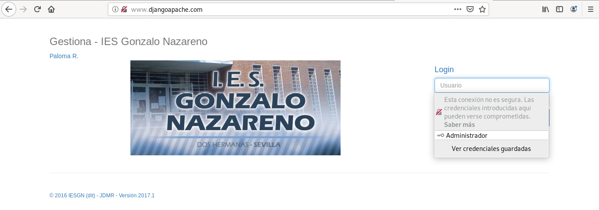
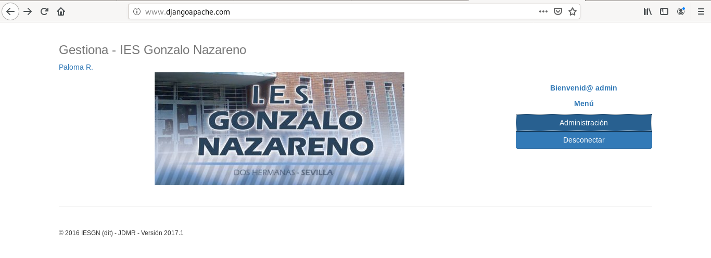

En este momento, muestra al profesor la aplicación funcionando. Entrega una documentación resumida donde expliques los pasos fundamentales para realizar esta tarea. (4 puntos)

**Tarea 4: Modificación de la aplicación en el entorno de producción**

Vamos a realizar cambios en el entorno de desarrollo y posteriormente vamos a subirlas a producción.

- Modifica la página inicial para que muestre otra imagen. Despliega los cambios en el servidor de producción.

Primero se modifica en desarrollo. 
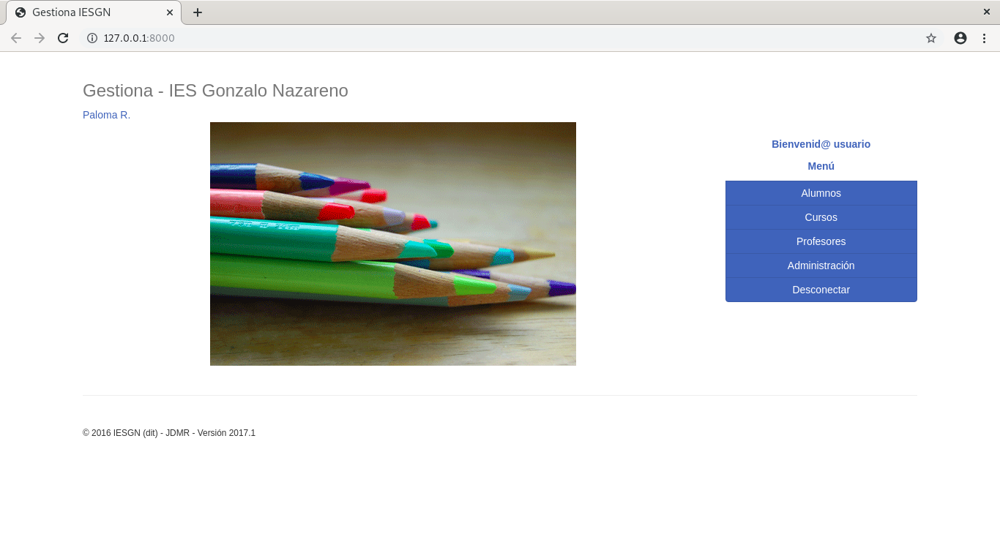

Despúes hay que subir los cambios al repositorio de GitHub y lo llevan los cambios a producción.
~~~
paloma@coatlicue:~/DISCO2/CICLO II/IMPLANTACIÓN DE APLICACIONES WEB/iaw_ge
stionGN$ git commit -m 'a ver'
En la rama master
Tu rama está actualizada con 'origin/master'.

Cambios no rastreados para el commit:
	modificado:     static/img/iesgn.jpg

Archivos sin seguimiento:
	Practica/himg.png

no se agregaron cambios al commit
paloma@coatlicue:~/DISCO2/CICLO II/IMPLANTACIÓN DE APLICACIONES WEB/iaw_ge
stionGN$ git commit -am 'cambios en la imagen principal'
[master ec7faf8] cambios en la imagen principal
 Committer: Paloma R <paloma@coatlicue.nahualt>
Tu nombre y correo fueron configurados automáticamente basados
en tu usuario y nombre de host. Por favor verifica que son correctos.
Tu puedes suprimir este mensaje configurándolos de forma explicita. Ejecuta el 
siguiente comando y sigue las instrucciones de tu editor
 para modificar tu archivo de configuración:

    git config --global --edit

Tras hacer esto, puedes arreglar la identidad usada para este commit con:

    git commit --amend --reset-author

 2 files changed, 0 insertions(+), 0 deletions(-)
 create mode 100644 Practica/himg.png
 rewrite static/img/iesgn.jpg (98%)
paloma@coatlicue:~/DISCO2/CICLO II/IMPLANTACIÓN DE APLICACIONES WEB/iaw_ge
stionGN$ git push
Enumerando objetos: 12, listo.
Contando objetos: 100% (12/12), listo.
Compresión delta usando hasta 2 hilos
Comprimiendo objetos: 100% (7/7), listo.
Escribiendo objetos: 100% (7/7), 259.30 KiB | 11.79 MiB/s, listo.
Total 7 (delta 3), reusado 0 (delta 0)
remote: Resolving deltas: 100% (3/3), completed with 3 local objects.
To github.com:PalomaR88/iaw_gestionGN.git
   dc21584..ec7faf8  master -> master
~~~

~~~
(django) debian@python:/var/www/html/iaw_gestionGN$ sudo git pull
remote: Enumerating objects: 16, done.
remote: Counting objects: 100% (16/16), done.
remote: Compressing objects: 100% (12/12), done.
remote: Total 16 (delta 5), reused 15 (delta 4), pack-reused 0
Unpacking objects: 100% (16/16), done.
From https://github.com/PalomaR88/iaw_gestionGN
   a4c5ddd..ec7faf8  master     -> origin/master
Updating a4c5ddd..ec7faf8
Fast-forward
 Practica/Practica.md | 455 +++++++++++++++++++++++++++++++++++++++++++++
 Practica/fimg.png    | Bin 0 -> 241972 bytes
 Practica/gimg.png    | Bin 0 -> 232284 bytes
 Practica/himg.png    | Bin 0 -> 197660 bytes
 static/img/iesgn.jpg | Bin 29353 -> 73483 bytes
 5 files changed, 455 insertions(+)
 create mode 100644 Practica/fimg.png
 create mode 100644 Practica/gimg.png
 create mode 100644 Practica/himg.png
~~~

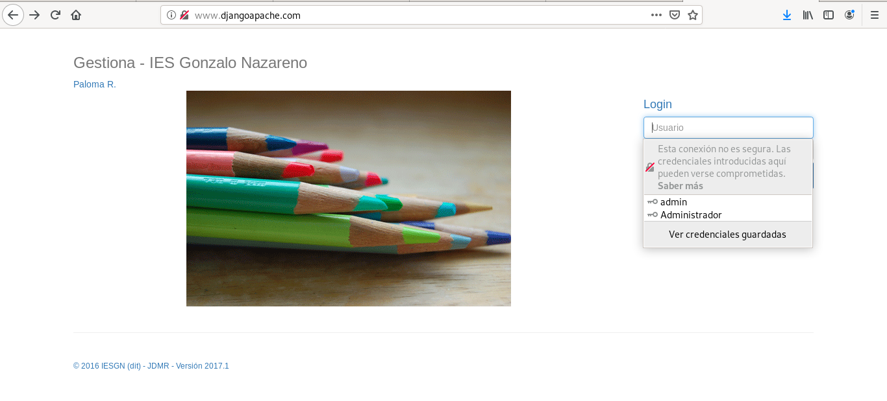

- Vamos a crear una nueva tabla en la base de datos, para ello sigue los siguientes pasos:
1. Añade un nuevo modelo al fichero centro/models.py:
~~~
     class Modulos(models.Model):	
         Abr = models.CharField(max_length=4)
         Nombre = models.CharField(max_length=50)
         Unidad = models.ForeignKey(Cursos,blank=True,null=True,on_delete=models.SET_NULL)
    		
         def __unicode__(self):
             return self.Abr+" - "+self.Nombre 		
         class Meta:
             verbose_name="Modulo"
             verbose_name_plural="Modulos"
~~~

2. Crea una nueva migración: python3 manage.py makemigrations.
~~~
(django) paloma@coatlicue:~/DISCO2/CICLO II/IMPLANTACIÓN DE APLICACIONES W
EB/iaw_gestionGN$ python3 manage.py makemigrations
Migrations for 'centro':
  centro/migrations/0007_modulos.py
    - Create model Modulos
~~~

3. Y realiza la migración: python3 manage.py migrate
~~~
(django) paloma@coatlicue:~/DISCO2/CICLO II/IMPLANTACIÓN DE APLICACIONES W
EB/iaw_gestionGN$ python3 manage.py migrate
Operations to perform:
  Apply all migrations: admin, auth, centro, contenttypes, convivencia, sessions
Running migrations:
  Applying centro.0007_modulos... OK
~~~

4. Añade el nuevo modelo al sitio de administración de django:

- Para ello cambia la siguiente línea en el fichero centro/admin.py:
~~~
from centro.models import Cursos,Alumnos,Departamentos,Profesores,Areas
~~~

Por esta otra:
~~~
from centro.models import Cursos,Alumnos,Departamentos,Profesores,Areas,Modulos
~~~

Y añade al final la siguiente línea:
~~~
admin.site.register(Modulos)
~~~

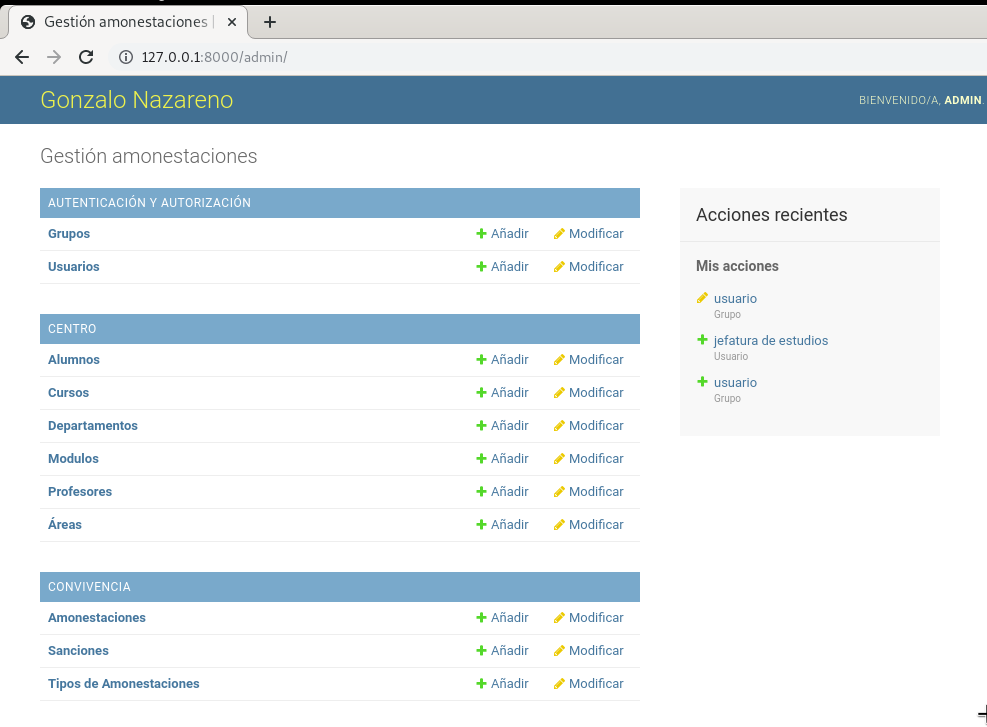

- Despliega el cambio producido al crear la nueva tabla en el entorno de producción.

En desarrollo:
~~~
(django) paloma@coatlicue:~/DISCO2/CICLO II/IMPLANTACIÓN DE APLICACIONES WEB/iaw_gestionGN$ git commit -m 'a ver'
En la rama master
Tu rama está actualizada con 'origin/master'.

Archivos sin seguimiento:
	Practica/iimg.png
	Practica/jimg.png
	centro/migrations/0007_modulos.py

no hay nada agregado para confirmar, pero hay archivos sin seguimiento presentes
(django) paloma@coatlicue:~/DISCO2/CICLO II/IMPLANTACIÓN DE APLICACIONES WEB/iaw_gestionGN$ git add Practica/iimg.png Practica/jimg.png centro/migrations/0007_modulos.py 
(django) paloma@coatlicue:~/DISCO2/CICLO II/IMPLANTACIÓN DE APLICACIONES WEB/iaw_gestionGN$ git commit -m 'subo modulo' 
[master 8428483] subo modulo
 Committer: Paloma R <paloma@coatlicue.nahualt>
Tu nombre y correo fueron configurados automáticamente basados
en tu usuario y nombre de host. Por favor verifica que son correctos.
Tu puedes suprimir este mensaje configurándolos de forma explicita. Ejecuta el 
siguiente comando y sigue las instrucciones de tu editor
 para modificar tu archivo de configuración:

    git config --global --edit

Tras hacer esto, puedes arreglar la identidad usada para este commit con:

    git commit --amend --reset-author

 3 files changed, 27 insertions(+)
 create mode 100644 Practica/iimg.png
 create mode 100644 Practica/jimg.png
 create mode 100644 centro/migrations/0007_modulos.py
(django) paloma@coatlicue:~/DISCO2/CICLO II/IMPLANTACIÓN DE APLICACIONES WEB/iaw_gestionGN$ git commit -am 'subo modulo' 
En la rama master
Tu rama está adelantada a 'origin/master' por 1 commit.
  (usa "git push" para publicar tus commits locales)

nada para hacer commit, el árbol de trabajo está limpio
(django) paloma@coatlicue:~/DISCO2/CICLO II/IMPLANTACIÓN DE APLICACIONES WEB/iaw_gestionGN$ git push
Enumerando objetos: 12, listo.
Contando objetos: 100% (12/12), listo.
Compresión delta usando hasta 2 hilos
Comprimiendo objetos: 100% (8/8), listo.
Escribiendo objetos: 100% (8/8), 255.91 KiB | 12.79 MiB/s, listo.
Total 8 (delta 4), reusado 0 (delta 0)
remote: Resolving deltas: 100% (4/4), completed with 4 local objects.
To github.com:PalomaR88/iaw_gestionGN.git
   4c1a2de..8428483  master -> master
~~~

En producción:
~~~
(django) debian@python:/var/www/html/iaw_gestionGN$ sudo git pull
remote: Enumerating objects: 7, done.
remote: Counting objects: 100% (7/7), done.
remote: Compressing objects: 100% (6/6), done.
remote: Total 7 (delta 1), reused 2 (delta 1), pack-reused 0
Unpacking objects: 100% (7/7), done.
From https://github.com/PalomaR88/iaw_gestionGN
   ec7faf8..4c1a2de  master     -> origin/master
Updating ec7faf8..4c1a2de
Fast-forward
 Practica/Practica.md | 95 +++++++++++++++++++++++++++++++++++++++++++++-
 centro/admin.py      |  4 +-
 centro/models.py     | 10 ++++-
 3 files changed, 106 insertions(+), 3 deletions(-)
(django) debian@python:/var/www/html/iaw_gestionGN$ python3 manage.py makemigrations
(django) debian@python:/var/www/html/iaw_gestionGN$ python3 manage.py migrate
Operations to perform:
  Apply all migrations: admin, auth, centro, contenttypes, convivencia, sessions
Running migrations:
  Applying centro.0007_modulos... OK
(django) debian@python:/var/www/html/iaw_gestionGN$ ./manage.py loaddata datos.json 
Installed 89 object(s) from 1 fixture(s)

~~~

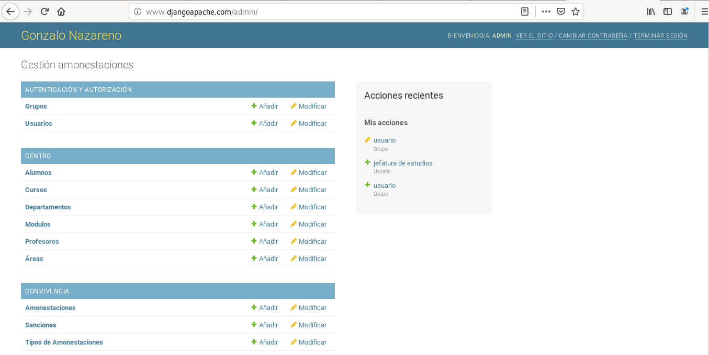

**Tarea 5: Despliegue de nuestra aplicación en un hosting python: pythonanywhere**

- Siguiendo la documentación despliega nuestra aplicación django en pythonanwhere. Utiliza git para desplegar los ficheros y crea una base de datos en tu proyecto. Si con la documentación no es suficiente puede seguir mi documento: Despliegue de aplicación flask en hosting pythonanywhere.

Se accede a [pythonanywhere](https://www.pythonanywhere.com/). Se selecciona la opción "Start runnung Python online in less than a minute!" > "Create a Beginner account". Y se compleata los datos personales que pide para logearse.

Una vez confirmada la dirección de correo del usuario, se selecciona la opción base de datos y se agrega una contraseña.

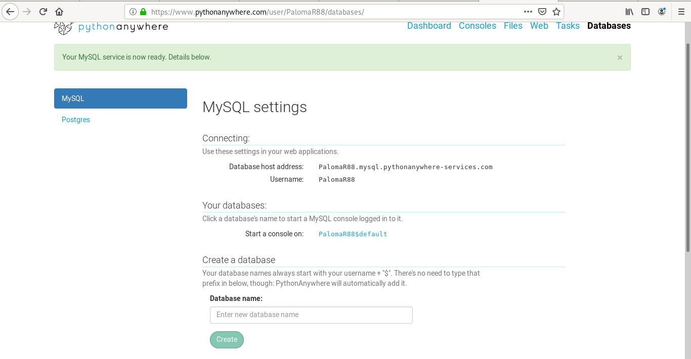

Se cloona el repositorio de GitHub:
~~~
08:35 ~ $ git clone https://github.com/PalomaR88/iaw_gestionGN.git
~~~

Se modifica el fichero gestion/settings.py para indicar la base de datos:
~~~
DATABASES = {
        SQLALCHEMY_DATABASE_URI = 'mysql+pymysql://PalomaR88:usuario1234@
PalomaR88.mysql.pythonanywhere-services.com/PalomaR88$default'
    }
}
~~~

A continuación vamos a crear la aplicación web, en la pestaña Web del sitio pythonanywhere. Y se crea el entorno virtual para descargar los paquetes que hay en requeriments.txt:
~~~
09:10 ~ $ mkvirtualenv --python=/usr/bin/python3.4 flask
Running virtualenv with interpreter /usr/bin/python3.4
Already using interpreter /usr/bin/python3.4
Using base prefix '/usr'
New python executable in /home/PalomaR88/.virtualenvs/flask/bin/python3.4
Also creating executable in /home/PalomaR88/.virtualenvs/flask/bin/python
Installing setuptools, pip<19.2, wheel...
done.
virtualenvwrapper.user_scripts creating /home/PalomaR88/.virtualenvs/flas
k/bin/predeactivate
virtualenvwrapper.user_scripts creating /home/PalomaR88/.virtualenvs/flas
k/bin/postdeactivate
virtualenvwrapper.user_scripts creating /home/PalomaR88/.virtualenvs/flas
k/bin/preactivate
virtualenvwrapper.user_scripts creating /home/PalomaR88/.virtualenvs/flas
k/bin/postactivate
virtualenvwrapper.user_scripts creating /home/PalomaR88/.virtualenvs/flas
k/bin/get_env_details
(flask) 09:11 ~ $ pip install -r iaw_gestionGN/requirements.txt 
~~~
- Identificación de problemas: si estamos desarrollando una aplicación es necesario probarla, realizar test.

- Identificación de problemas: además de lo anterior el equipo de desarrollo necesita ir haciendo otros procesos: analizando el código generado, generar documentación,…

- Identificación de problemas: Nuestro equipo de desarrollo las componen varios miembros: es fundamental utilizar un repositorio común (git)

- Identificación de problemas: Si seguimos una metodología ágil es deseable que todos los cambios que vayan realizando los programadores se vayan probando, analizando, … de forma continúa

- Identificación de problemas: ¿Y si esas tareas las automatizamos? -> Integración continúa

